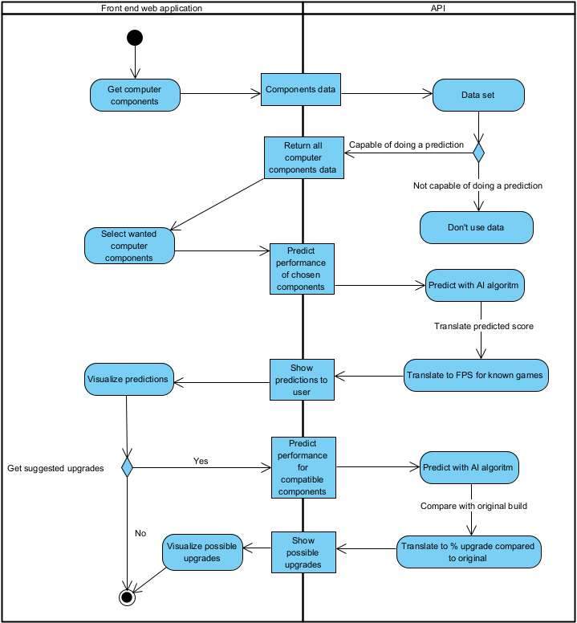

# Goal
De game industrie is een snel groeiende industrie dat volgens experts kan uitgroeien naar een industrie met een marktwaarde van $ 300 miljard. Met miljarden dollars winst en meer dan 2,5
miljard gamers wereldwijd is dit een interessante doelgroep om een rendabele applicatie voor te ontwikkelen. Deze groeiende game industrie gaat gepaard met de hardware die noodzakelijk is om de industrie te betreden. Beginnende en amateur gamers komen dikwijls voor een moeilijke keuze te staan wanneer ze moeten beslissen welke hardware ze nodig hebben om aan hun game noden te voldoen. We zouden een applicatie willen creëren die een amateur gamer kan helpen zijn computer onderdelen uit te kunnen kiezen en bij te leren/informen over computer hardware. De applicatie zou dan kunnen gebruikt worden om klanten te overtuigen tot aankoop en kan verkopers helpen om klanten correct te informeren. Deze applicatie zal aan de hand van een dataset van computer hardware voorspellingen maken van de performantie van een computer. Hier bij kan een gebruiker al zijn componenten ingeven die hij al heeft en dan 1 component vervangen om een upgrade voor zijn PC te simuleren. Hij kan ook 2 computers vergelijken om zo zijn keuze tot aankoop makkelijker te maken.  

# Acceptance criteria
De applicatie zou meerdere functies moeten kunnen uitvoeren:
- er is een lijst van alle componenten aanwezig waarvan we genoeg data hebben om correcte voorspelling uit te voeren
- we filteren componenten zodat enkel componenten die met elkaar compatibel zijn kunnen geselecteerd worden
- de gebruiker kan componenten selecteren en een voorspelling aanvragen
- de gebruiker zal een visualisatie te zien krijgen van de voorspelling door middel van verwachte gemiddelde FPS te tonen bij een aantal bekende spellen
- de gebruiker kan zelf mogelijke upgrades aanvragen waardoor er meerdere voorspellingen zullen uitgevoerd worden met alleen compatibele componenten
- er is een tutorial aanwezig die uitlegt hoe je de applicatie kan gebruiken

# Threat model

- Data Integriteit: Hashing

- Overbelasting API: API tokens

- (D)DOS: DDoS-mitigatie

- Injecties: API is niet toegankelijk voor gebruiker-input

# Deployment
*minimally, this section contains a public URL of the app. A description of how your software is deployed is a bonus. Do you do this manually, or did you manage to automate? Have you taken into account the security of your deployment process?*
# *you may want further sections*
*especially if the use of your application is not self-evident*
